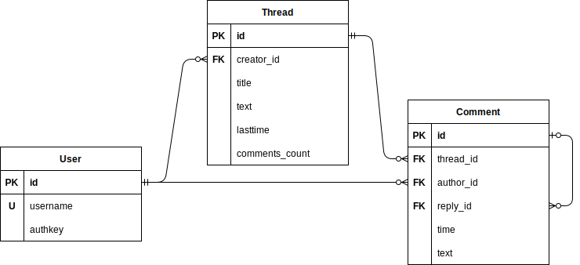

##### Розгорнутий на Heroku застосунок
[Lab3Forum - Main Page](http://lab3forum.herokuapp.com/)

-----
##### Розгортання на локальній машині

```shell
git clone https://github.com/55AAh/DB_Lab3.git
cd DB_Lab3
python -m pip install -r requirements.txt
```

Параметри підключення до БД задаються
змінною оточення ```DATABASE_URL``` (у ```JDBC```-форматі),
або у файлі ```flyway.conf```.

Змінні оточення для backend-у: ```HOST```, ```PORT``` та ```DEBUG```.

```shell
python app.py
```

-----

##### Діаграма зв'язків сутностей
